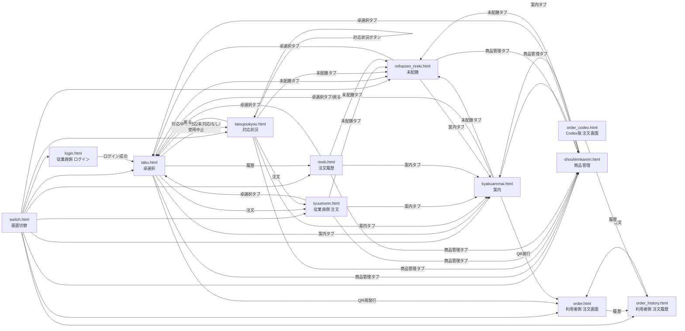
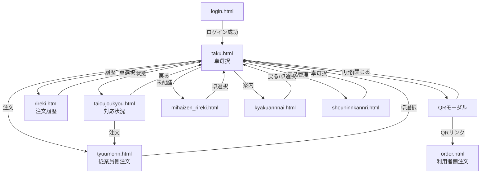
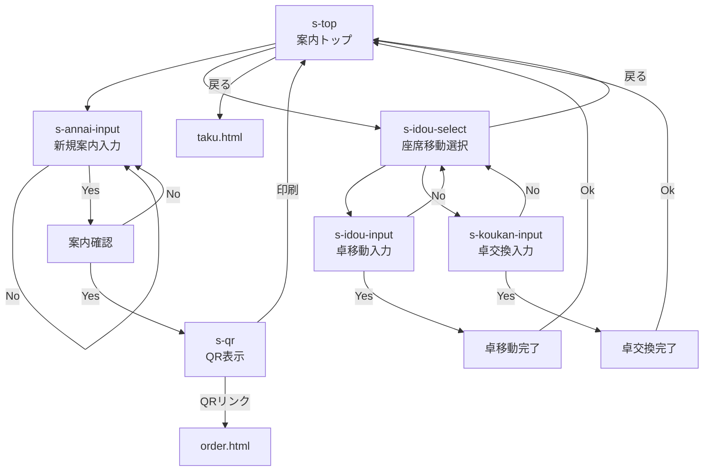
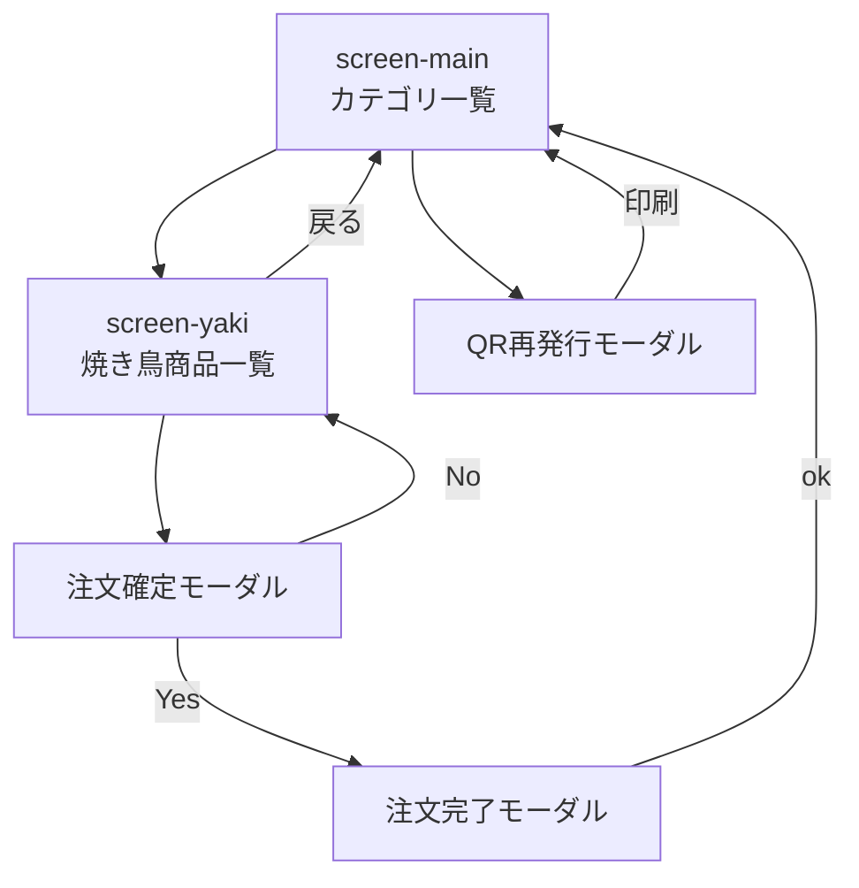
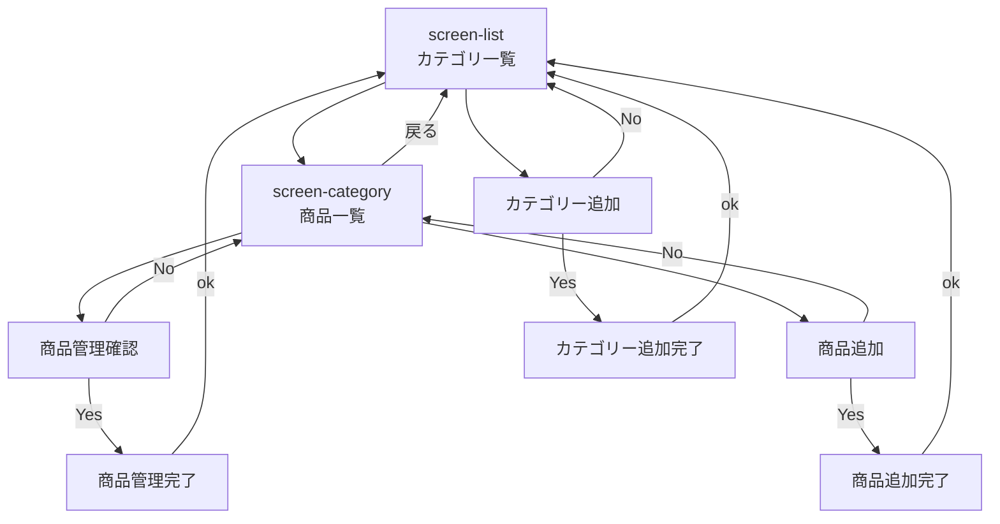
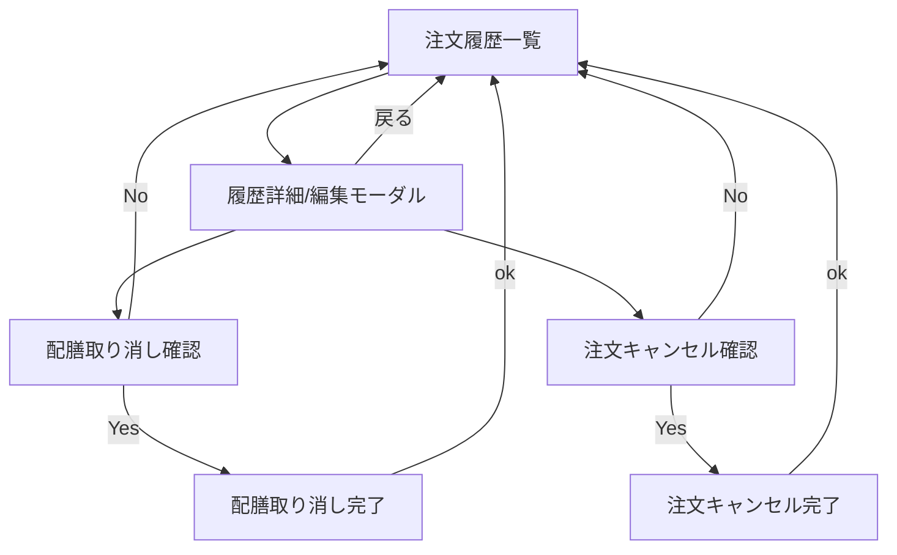
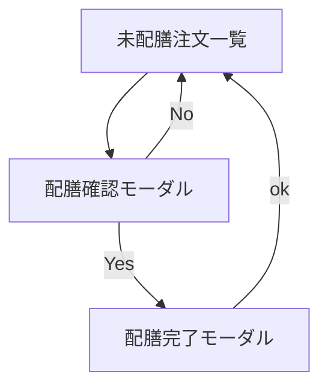
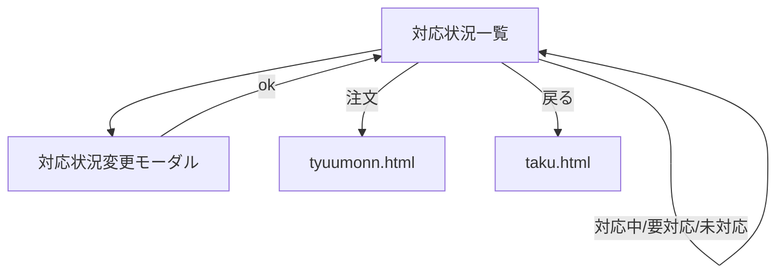

# HTML画面遷移図

対象: `demo/src/main/resources/templates/*.html`

## 全体画面遷移



## 利用者側画面

```mermaid
flowchart TD
  order["order.html<br/>注文画面"] --> orderModal["注文確認モーダル"]
  orderModal -- No --> order
  orderModal -- Yes --> complete["注文完了モーダル"]
  complete -- ok --> order
  order --> payment["会計確認モーダル"]
  payment -- No --> order
  payment -- Yes --> paymentDone["精算待機モーダル"]
  paymentDone -- ok --> order
  order --> call["店員呼出確認モーダル"]
  call -- No --> order
  call -- Yes --> callDone["店員呼出待機モーダル"]
  callDone -- ok --> order
  order --> historyConfirm["履歴確認モーダル"]
  historyConfirm -- No --> order
  historyConfirm -- Yes --> orderHistory["order_history.html"]
  orderHistory -- 注文 --> order

  orderCodex["order_codex.html<br/>Codex版 注文画面"] --> orderCodexHistory["order_history.html"]
```

## 従業員側メイン導線



## 各HTML内の画面・モーダル遷移

### `kyakuannnai.html`



### `tyuumonn.html`



### `shouhinnkannri.html`



### `rireki.html`



### `mihaizen_rireki.html`



### `taioujoukyou.html`



## 備考

- `/` と `/switch` は `switch.html` を表示します。
- `/order` と `/order.html` は `order.html` を表示します。
- `/order_codex` と `/order_codex.html` は `order_codex.html` を表示します。
- `/order_history` と `/order_history.html` は `order_history.html` を表示します。
- `order_codex.html` は `order.html` のコピー版として追加されたUI改善版です。
